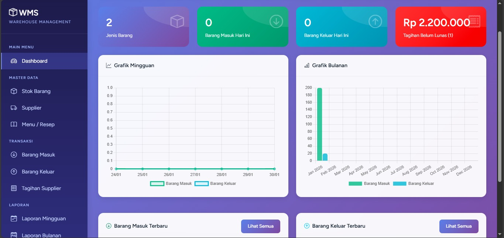
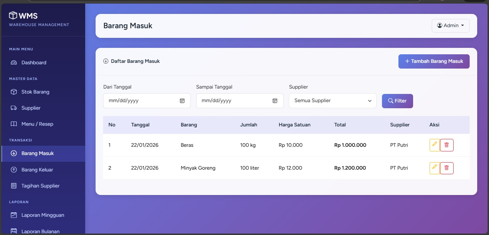
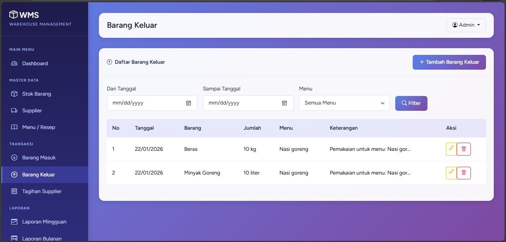
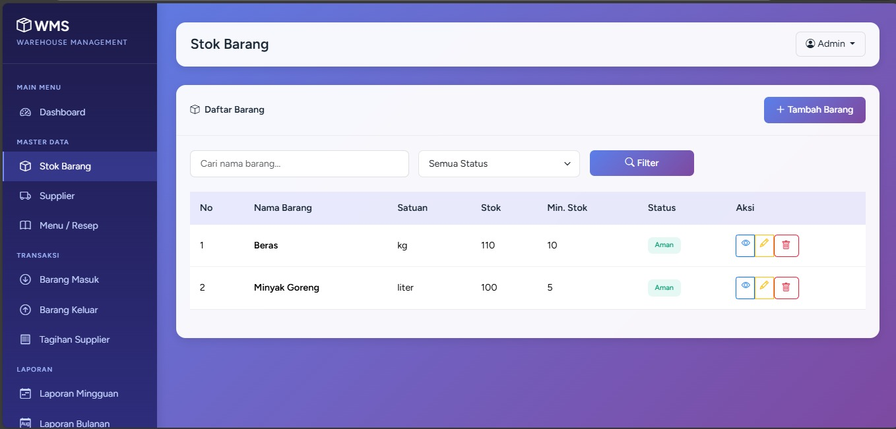
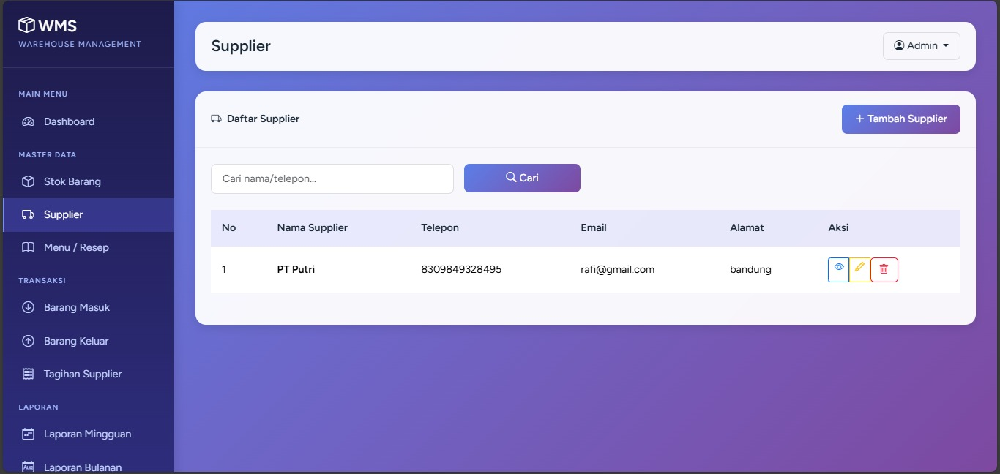
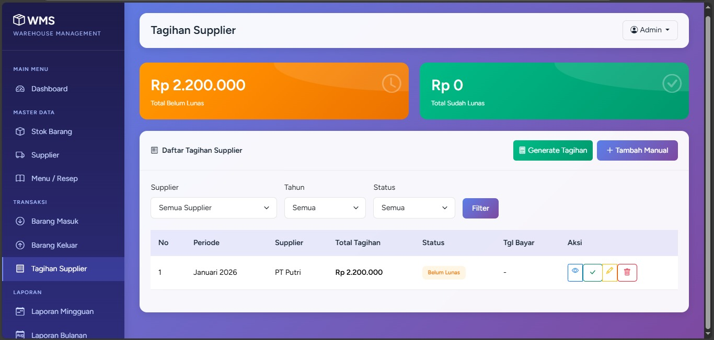
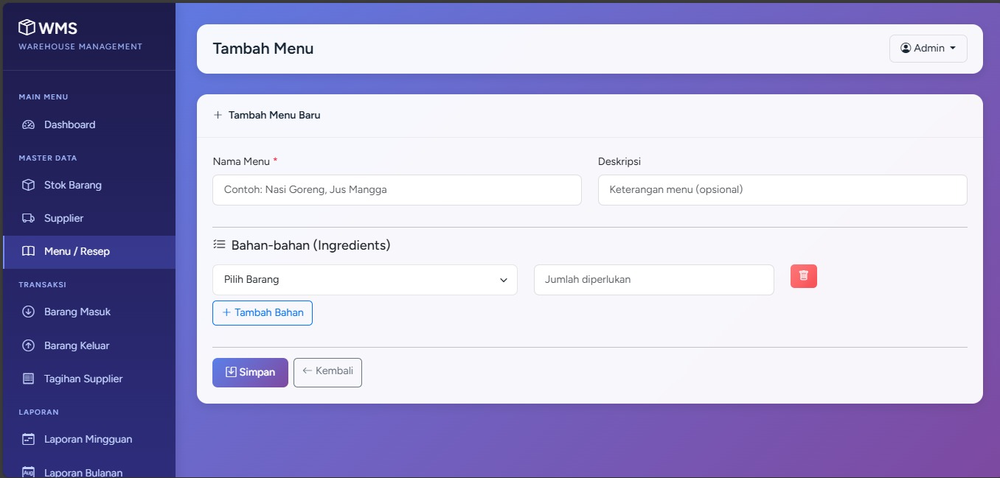

# Warehouse Management System - Integrated Inventory Solution

Sistem manajemen inventaris berbasis web yang dirancang untuk mengotomatisasi pencatatan stok dan pelaporan keuangan operasional secara *real-time*. Proyek ini difokuskan pada transparansi arus barang dan kemudahan akses data stok bagi manajemen gudang.

## 📂 Dokumentasi Visual Sistem

### 1. Dashboard Monitoring & Keuangan

Menampilkan ringkasan total belanja, status pembayaran (Lunas/Pending), dan visualisasi data stok secara otomatis untuk membantu pengambilan keputusan yang cepat.



### 2. Manajemen Arus Barang (In & Out)

Antarmuka pencatatan barang masuk per supplier dan pemakaian stok (barang keluar) yang mendetail untuk memastikan integritas data inventaris.

 

### 3. Monitoring Stok Akhir 

Tabel stok barang yang diperbarui secara *real-time* dan database supplier yang terintegrasi untuk memudahkan pemesanan kembali barang yang menipis.



### 4. Monitoring Supplier

Tabel Monitoring Supplier secara *real-time* dan database supplier yang terintegrasi untuk memudahkan pemesanan kembali barang yang menipis.



### 5. Tagihan Supplier
Fitur Tagihan Supplier berfungsi sebagai pusat kendali finansial yang mencatat setiap kewajiban pembayaran atas pengadaan barang yang telah diterima. Sistem ini secara otomatis mengintegrasikan setiap transaksi barang masuk ke dalam modul utang, memungkinkan pengguna untuk memantau saldo tagihan secara mendalam berdasarkan masing-masing penyuplai. Dengan adanya klasifikasi status pembayaran yang jelas antara "Lunas" dan "Pending", manajemen dapat melakukan rekonsiliasi data dengan faktur fisik secara lebih akurat, menghindari risiko pembayaran ganda, serta menjaga integritas hubungan kerja sama dengan mitra supplier melalui ketepatan waktu pembayaran. Seluruh data yang terekam dalam fitur ini secara dinamis akan memperbarui ringkasan laporan keuangan pada dashboard utama, memberikan visibilitas total terhadap arus kas keluar dan liabilitas perusahaan yang masih berjalan.



### 6. Resep & Menu
Fitur ini berfungsi untuk mengelola komposisi bahan baku (resep) dari setiap produk yang tersedia. Sistem secara otomatis akan memotong saldo stok di gudang setiap kali terjadi pemakaian atau penjualan menu, memastikan sinkronisasi data antara stok mentah dan produk jadi secara real-time. Dengan fitur ini, perhitungan HPP menjadi lebih akurat dan risiko selisih stok akibat pemakaian bahan yang tidak terukur dapat diminimalisir.



### 7. Laporan Operasional Siap Cetak

Sistem pelaporan mingguan dan bulanan yang mencakup rincian transaksi lengkap dan siap diekspor ke format PDF/Excel untuk kebutuhan administrasi formal.


---

## 🚀 Fitur Utama & Solusi Teknis

* **Real-Time Stock Tracking:** Pengurangan dan penambahan stok otomatis yang dikunci secara *back-end* untuk mencegah selisih data.
* **Financial Summary:** Pelacakan tagihan supplier untuk membedakan transaksi yang sudah dibayar (Lunas) dan yang masih tertunda (Pending).
* **Detailed Supplier Transactions:** Dokumentasi lengkap riwayat pengadaan barang dari setiap mitra penyuplai.
* **Multi-Format Export:** Kemampuan cetak laporan operasional ke dalam format PDF dan Excel dengan tata letak yang profesional.

---

## 🛠️ Teknologi (Tech Stack)

* **Framework:** Laravel (PHP).
* **Database:** MySQL (Manajemen relasi Stok, Supplier, dan Transaksi).
* **Frontend:** Bootstrap / AdminLTE Dashboard.
* **Reporting:** DomPDF & Laravel Excel (Maatwebsite).

---

## ⚙️ Instalasi Cepat

```bash
git clone https://github.com/puttribakkaraa/warehouse-management-system.git
cd warehouse-management-system
composer install
cp .env.example .env
php artisan key:generate
php artisan migrate --seed
php artisan serve

```

---

© 2026 Putri • WMS Project System

